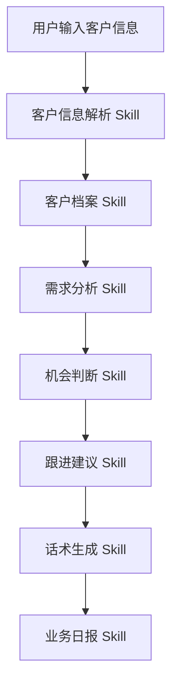
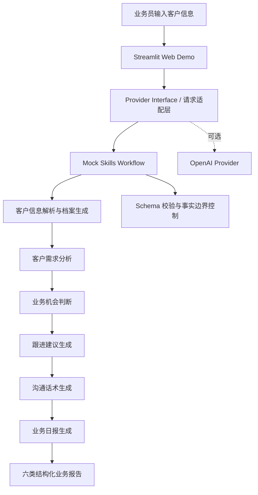
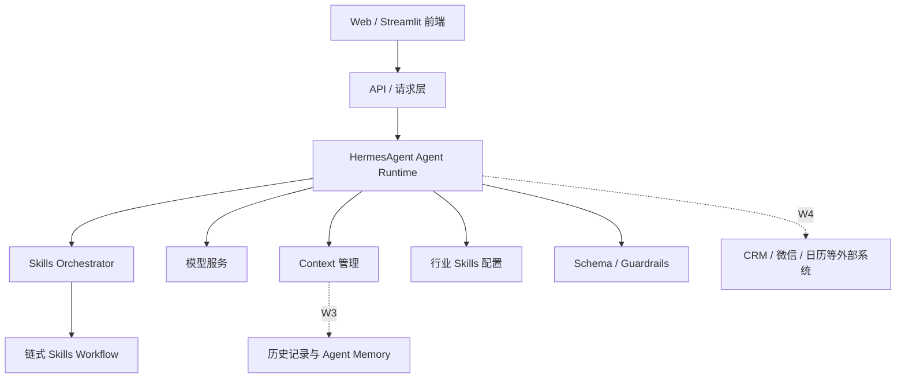

# AI+应用项目提案（Specs）

# 知客 ZhiKe AI

**文档版本：** S3W1 Specs v1.0  
**适用赛段：** S3 全球青年培育赛 · W1  
**项目名称：** 知客 ZhiKe AI  
**项目定位：** 面向业务员的 AI 业务处理智能体

---

## 1. 项目概述

### 1.1 项目名称

知客 ZhiKe AI

### 1.2 项目定位

知客 ZhiKe AI 是一个面向业务员、客户经理、企业服务顾问和课程顾问的 AI 业务处理智能体。它通过分析客户信息和沟通记录，帮助业务人员生成客户档案、需求分析、业务机会判断、跟进建议、沟通话术和业务日报，将资深业务人员的经验转化为可复制、可评测、可迭代的 AI 工作流程。

### 1.3 目标用户

第一阶段目标用户包括：

- 销售人员；
- 客户经理；
- 企业服务顾问；
- 课程顾问。

未来可扩展用户包括：

- 房产经纪；
- 跨境服务顾问；
- 招商人员；
- 其他需要长期处理客户跟进事务的顾问型业务人员。

### 1.4 核心价值

知客 ZhiKe AI 的核心价值不是“替业务员聊天”，而是帮助业务员完成从客户信息理解到业务行动生成的关键工作：

```text
客户信息输入
↓
客户信息解析
↓
客户档案生成
↓
客户需求分析
↓
业务机会判断
↓
跟进建议生成
↓
沟通话术生成
↓
业务日报生成
```

知客不是普通聊天机器人。普通聊天机器人以开放式问答为主，输出容易受提示词质量影响。知客将客户跟进任务拆解为明确的业务流程和 Skills，让输出更稳定、更可评测。

知客也不是传统 CRM。传统 CRM 主要承担客户资料记录、销售流程管理和数据存储功能；知客则进一步关注“如何理解客户、判断需求、生成下一步行动”，帮助业务人员把分散信息转化为可执行的业务建议。

“知客”原指负责接待来访者、了解来意并妥善安排事务的人。本项目将这一角色延伸为业务员身边的 AI 知客：理解客户、判断需求、生成行动建议，帮助业务人员把分散的客户信息转化为清晰、可执行的业务行动。

---

## 2. 应用场景与用户痛点

### 2.1 典型应用场景

在真实业务中，业务员往往需要同时处理多个客户线索。客户信息可能来自微信聊天、电话沟通、会议纪要、名片、表单、手动备注等多种渠道。业务员不仅要记录客户说了什么，还要判断客户真正关心什么、当前处于什么阶段、下一步应该如何跟进。

知客 ZhiKe AI 的典型使用场景包括：

1. 客户初次咨询后，业务员输入聊天记录或电话纪要，系统生成客户档案和需求摘要；
2. 准备下一次跟进前，系统根据客户背景和沟通内容生成跟进建议、准备材料和沟通话术；
3. 每日业务复盘时，系统汇总客户情况，生成业务日报，包括重点客户、待办事项、风险提醒和明日计划。

### 2.2 痛点 1：客户信息碎片化

客户信息常见来源包括：

- 微信聊天；
- 电话记录；
- 会议纪要；
- 名片信息；
- 表单记录；
- 业务员手动备注。

这些信息往往格式不统一、内容不完整、分散在多个工具中，导致业务员难以快速形成统一客户画像。尤其在客户数量较多时，业务员容易遗漏关键需求、时间计划、预算信号和风险因素。

### 2.3 痛点 2：业务判断依赖个人经验

客户跟进不是简单的信息记录，而是需要业务员判断：

- 客户真实需求是什么；
- 客户当前处于了解、比较、试用还是采购决策阶段；
- 客户最关心价格、部署难度、实际效果、合规风险还是内部推动成本；
- 下一步应该确认需求、发送资料、预约会议，还是暂缓推进。

资深业务员可以凭经验快速判断重点，但新人业务员往往不知道该看哪些信号，也容易把“客户感兴趣”误判为“高意向客户”。这会导致跟进优先级失衡、沟通动作过急或关键问题未确认。

### 2.4 痛点 3：业务流程无法标准化

优秀业务员的经验通常存在于个人习惯中，难以复制到团队。例如：

- 如何从聊天记录中提取客户画像；
- 如何区分显性需求和潜在痛点；
- 如何判断商机等级；
- 如何生成合适的话术；
- 如何把当天客户情况汇总成日报。

如果这些流程无法标准化，新人培养成本会提高，团队管理者也难以统一评估业务过程质量。知客 ZhiKe AI 试图将这类经验拆解为可执行的 AI Skills，让业务判断过程更透明、更可复用。

---

## 3. 产品需求设计（核心）

本章节以产品功能需求（Functional Requirements, FR）的方式描述知客 ZhiKe AI 的核心能力。每项功能均包含功能名称、用户输入、AI 处理逻辑、输出结果和验收标准。

### FR1：客户信息解析 Agent

| 项目 | 内容 |
|---|---|
| 功能名称 | 客户信息解析 Agent |
| 用户输入 | 客户聊天记录、业务备注、电话纪要、会议记录等非结构化文本 |
| AI 处理逻辑 | 从文本中提取客户身份、行业、角色、需求、关注点、预算信号、时间计划和当前阶段；保留关键原文依据 |
| 输出结果 | 结构化客户信息，包括客户称谓、行业、角色、需求、关注点、当前阶段、待确认字段 |
| 验收标准 | 关键字段提取完整；未出现的信息标注为“未知/待确认”；推断内容标注为“推断”；不将原文没有的信息写成事实 |

### FR2：客户档案生成 Agent

| 项目 | 内容 |
|---|---|
| 功能名称 | 客户档案生成 Agent |
| 用户输入 | FR1 输出的结构化客户信息 |
| AI 处理逻辑 | 将分散字段合并为统一客户档案，去重、归类并补充待确认事项 |
| 输出结果 | 统一客户档案，包含基本信息、核心需求、关注点、决策阶段、时间计划和待确认事项 |
| 验收标准 | 档案字段完整、分类清晰、便于业务员快速查看；不出现明显字段错位 |

### FR3：客户需求分析 Agent

| 项目 | 内容 |
|---|---|
| 功能名称 | 客户需求分析 Agent |
| 用户输入 | 客户档案、原始证据片段、客户关注点 |
| AI 处理逻辑 | 分析显性需求、潜在痛点、决策因素、成交阻碍和待确认问题 |
| 输出结果 | 需求分析报告，包括显性需求、潜在痛点、决策因素、待确认问题 |
| 验收标准 | 显性需求必须来自原文；潜在痛点必须标注为推断；未知信息不能被补写为事实 |

### FR4：业务机会判断 Agent

| 项目 | 内容 |
|---|---|
| 功能名称 | 业务机会判断 Agent |
| 用户输入 | 客户需求分析、预算信号、时间信号、意向强度、风险因素 |
| AI 处理逻辑 | 基于需求匹配度、意向信号、预算明确度、时间计划和风险因素，审慎判断商机等级 |
| 输出结果 | 商机等级、判断依据、有利信号、风险因素、不确定事项 |
| 验收标准 | 不能无依据判断成交概率；不能因为客户感兴趣就直接判定为高意向；必须同时列出有利信号与风险因素 |

建议商机等级包括：

- 高；
- 中高；
- 中；
- 低；
- 暂不判断。

### FR5：跟进建议 Agent

| 项目 | 内容 |
|---|---|
| 功能名称 | 跟进建议 Agent |
| 用户输入 | 客户档案、需求分析、业务机会判断 |
| AI 处理逻辑 | 将分析结果转化为业务员可执行的下一步行动 |
| 输出结果 | 下一步动作、时间建议、沟通目标、准备材料、优先级 |
| 验收标准 | 每条建议尽量包含动作、对象、时点和目标；建议应符合客户当前阶段；不跳过需求确认直接推进成交 |

### FR6：沟通话术 Agent

| 项目 | 内容 |
|---|---|
| 功能名称 | 沟通话术 Agent |
| 用户输入 | 客户称谓、沟通渠道、客户关注点、跟进目标、禁止承诺项 |
| AI 处理逻辑 | 根据客户阶段和沟通目标，生成微信、电话或邮件参考话术 |
| 输出结果 | 可编辑、可直接参考的沟通话术 |
| 验收标准 | 不虚构事实；不承诺未经验证的效果；语言自然，适合真实业务沟通；发送前由业务员人工确认 |

### FR7：业务日报 Agent

| 项目 | 内容 |
|---|---|
| 功能名称 | 业务日报 Agent |
| 用户输入 | 当日客户处理结果、重点客户、跟进建议、风险提醒 |
| AI 处理逻辑 | 汇总客户情况，进行优先级排序、待办合并和风险归纳 |
| 输出结果 | 今日客户情况、优先级排序、待办事项、风险提醒、明日计划 |
| 验收标准 | 日报覆盖输入范围内的客户；待办能对应具体客户；风险提醒可回溯到客户信息；不编造输入范围外的客户 |

---

## 4. Agent Workflow 设计

知客 ZhiKe AI 不是一个超长 Prompt，而是基于链式 Skills 的 Agent Workflow。系统将业务员原本依靠经验完成的客户理解、需求判断、跟进准备和日报汇总过程，拆解为多个可独立评测的业务 Skill。



### 4.1 工作流机制

每个 Skill 的输出会作为下一个 Skill 的上下文输入。系统优先传递结构化字段和关键证据片段，而不是反复读取全部原始聊天记录，从而降低长文本导致的注意力分散风险。

在关键判断中，系统要求区分：

- 事实：原始输入中明确出现的信息；
- 推断：基于上下文合理推测但需要人工确认的信息；
- 未知：输入中未出现或无法判断的信息。

这种设计使每个环节都可以被单独评测和调试。例如，信息提取错误可以定位到客户信息解析 Skill；跟进建议不合理可以定位到跟进建议 Skill，而不需要把整个系统视为一个不可解释的黑箱。

### 4.2 Skills 与业务专家经验的关系

知客 ZhiKe AI 的核心设计目标，是把资深业务人员的判断方法拆解为可运行流程。例如：

- 先识别客户是谁，再判断客户要什么；
- 先区分事实和推断，再生成业务建议；
- 先确认客户阶段，再决定沟通动作；
- 先列出风险和不确定因素，再判断商机等级；
- 先生成可执行待办，再汇总业务日报。

这些步骤构成了从“经验驱动”到“流程驱动”的 Agent 化转化。

---

## 5. 技术架构设计

### 5.1 总体技术架构图

以下架构分为“W2 已实现架构”和“后续目标架构”两层。W2 重点验证网页交互、结构化业务工作流和输出质量；HermesAgent Runtime、长期记忆及外部系统接入属于后续演进方向。

#### W2 已实现架构



W2 中，前一个环节的结构化输出作为后一个环节的上下文输入；业务日报在最后汇总当前客户与内存中的 Mock 今日客户。`Provider Interface` 用于隔离 Mock 模式与可选模型 Provider，便于后续接入其他 Agent Runtime。

#### 后续目标架构



该图表示产品的后续目标形态，不代表 W2 已完成 HermesAgent、长期 Memory、行业 Skills 配置或外部系统接入。

### 5.2 前后端解耦

前端建议采用 Streamlit Web Demo，用于快速验证产品交互和输出结构。

前端负责：

- 用户输入；
- 示例案例选择；
- 结果展示；
- JSON 模块化渲染；
- 评测结果展示。

前端不负责：

- Prompt 逻辑；
- 业务判断逻辑；
- Skills 调度逻辑；
- 模型推理策略。

这种设计可以避免把业务规则写死在页面中，便于后续替换 Agent Runtime 或新增行业 Skills。

### 5.3 Agent 执行层

W2 阶段通过 `Provider Interface` 统一封装不同执行方式：

- `MockProvider`：在无外部模型和无 API Key 时，按已提交 Skills 的边界执行本地演示流程；
- `OpenAIProvider`：作为可选模型 Provider，按统一报告 Schema 返回结构化结果。

后续可将 HermesAgent Agent Runtime 接入该接口，负责：

- Agent 运行；
- Skills 调度；
- 上下文管理；
- 工具调用；
- 模型调用；
- 结构化输出校验。

因此，W2 不将 HermesAgent、长期 Memory 或外部工具调用表述为已完成能力；这些内容属于后续阶段的兼容性设计和演进目标。

### 5.4 Skills 层

业务能力通过 Skills 模块化表达。不同业务场景可以复用通用 Skills，也可以扩展行业 Skills。

例如：

- 教培销售：培训销售 Skill；
- 房产顾问：房产客户分析 Skill；
- 跨境服务：跨境客户需求分析 Skill；
- 企业服务：方案型销售跟进 Skill。

未来扩展新行业时，理想情况下无需修改前端和底层 Agent 架构，只需新增对应行业 Skills 或调整行业配置。

### 5.5 Memory / Context 层

需要区分短期上下文和长期记忆：

- **W2 Context：** 当前单次输入、前序 Skills 的结构化输出，以及 2—3 个内存 Mock 今日客户；
- **W3 Memory：** 历史沟通摘要、跟进记录和多客户状态；
- **W4 Context：** 企业知识库、权限范围和外部系统上下文。

W2 仅使用单次请求上下文和内存 Mock 数据，不使用数据库，不进行跨会话持久化。后续目标中可保存的上下文信息包括：

- 当前客户档案；
- 历史沟通摘要；
- 待确认问题；
- 跟进记录；
- 行业配置；
- 业务员偏好。

这些长期数据能力将在 W3/W4 根据隐私、权限和部署条件逐步扩展。

### 5.6 Schema / Guardrails 层

Schema / Guardrails 是保证业务输出可评测、可追溯的质量约束层，负责：

- 校验各 Skill 的结构化输入和输出字段；
- 检查必填字段、数据类型和输出模块完整性；
- 对信息标注“事实 / 推断 / 未知”；
- 缺失信息保持未知，不补写预算、决策权限或成交概率；
- 发现模型输出不符合约束时返回错误提示或切换 Mock 兜底流程。

该层将大模型的开放式文本能力约束为稳定的 B 端业务交付物，也是知客区别于普通聊天机器人的重要工程化机制。

---

## 6. 创新点

### 创新 1：将业务专家经验转化为 AI Skills

知客 ZhiKe AI 的创新不在于让模型“自由发挥”，而在于把资深业务员的判断方法拆解为信息解析、档案生成、需求分析、机会判断、跟进建议、话术生成和日报生成等可运行 Skills。

### 创新 2：从聊天式 AI 升级为任务型业务 Agent

普通聊天式 AI 依赖用户不断调整提示词，输出结果随机性较高。知客将客户跟进工作封装为任务型 Workflow，让业务员通过一次输入获得结构化业务处理结果。

### 创新 3：模块化架构支持行业快速复制

系统采用通用 Workflow + 行业 Skills 配置的方式设计。销售、课程顾问、企业服务、房产、跨境等场景虽然行业不同，但都存在客户理解、需求判断和跟进计划的共性流程，因此可以在同一架构上扩展。

### 创新 4：事实 / 推断 / 未知约束机制，提高业务建议可靠性

知客要求关键输出标注事实、推断和未知，避免将缺失信息自动补写为确定结论。对于预算、决策链、采购时间和成交概率等敏感字段，系统应保持审慎，不做无依据判断。

### 创新 5：从文本生成走向可评测业务交付物

知客的输出不是泛泛而谈的文本，而是客户档案、需求分析、商机判断、行动计划、沟通话术和业务日报等业务交付物。这些交付物可以被业务人员和评测者按照明确指标进行评分。

---

## 7. 产品评测标准

S3W1 晋级要求强调 Specs 需要包含清晰完整的产品需求和可执行的评测标准。因此，知客 ZhiKe AI 采用 100 分制评测体系，用于判断产品是否真正帮助业务员完成客户理解、需求判断和行动规划。

### 7.1 总体评分表

| 指标 | 权重 | 测试方法 |
|---|---:|---|
| 信息提取完整度 | 15 分 | 输入标准客户沟通文本，检查客户身份、行业、角色、需求、关注点、阶段等字段是否被正确提取 |
| 客户档案结构化程度 | 10 分 | 检查客户档案字段是否完整、归类是否清晰、是否便于业务员快速查看 |
| 需求分析准确性 | 15 分 | 对照输入文本，评估显性需求、潜在痛点、决策因素和待确认问题是否合理 |
| 商机判断合理性 | 10 分 | 检查商机等级是否有依据，是否同时列出有利信号与风险因素 |
| 跟进建议可执行性 | 15 分 | 检查建议是否包含动作、对象、时点和目标，是否符合客户当前阶段 |
| 沟通话术可用性 | 15 分 | 检查话术是否自然、可参考、体现客户关注点，并避免虚假承诺 |
| 业务日报完整度 | 10 分 | 检查日报是否覆盖输入范围客户，是否包含优先级、待办、风险和明日计划 |
| 用户操作体验 | 10 分 | 观察用户是否能低成本输入信息、生成结果并理解输出模块 |
| **合计** | **100 分** |  |

### 7.2 指标 1：信息提取完整度

| 项目 | 内容 |
|---|---|
| 测试输入 | 包含客户称谓、行业、角色、需求、关注点、时间计划、当前阶段的客户记录 |
| 评价方式 | 人工对照输入文本检查字段是否完整提取，并检查是否区分事实、推断和未知 |
| 合格标准 | 关键字段提取完整度不低于 80%；不出现关键事实臆造；重要字段可回溯到输入文本 |

### 7.3 指标 2：客户档案结构化程度

| 项目 | 内容 |
|---|---|
| 测试输入 | 客户信息解析结果 |
| 评价方式 | 检查档案是否包含基本信息、核心需求、关注点、当前阶段和待确认事项 |
| 合格标准 | 字段覆盖率不低于 90%；信息归类清晰；业务员可以在短时间内理解客户情况 |

### 7.4 指标 3：需求分析准确性

| 项目 | 内容 |
|---|---|
| 测试输入 | 客户档案及原始沟通证据 |
| 评价方式 | 对照原文检查显性需求是否准确，潜在痛点是否合理标注为推断，待确认问题是否有业务价值 |
| 合格标准 | 至少识别一项主要需求；至少提出一项待确认问题；不虚构预算、决策权限或采购时点 |

### 7.5 指标 4：商机判断合理性

| 项目 | 内容 |
|---|---|
| 测试输入 | 需求分析结果、预算信号、时间信号、意向强度、风险因素 |
| 评价方式 | 检查商机等级是否与证据一致，是否说明判断依据和风险 |
| 合格标准 | 判断审慎，不因客户表达兴趣就直接判定高意向；有利信号和不确定因素同时出现 |

### 7.6 指标 5：跟进建议可执行性

| 项目 | 内容 |
|---|---|
| 测试输入 | 客户档案、需求分析、商机判断 |
| 评价方式 | 检查每条建议是否包含下一步动作、对象、时间建议和沟通目标 |
| 合格标准 | 至少 80% 的建议经评测者判断可执行；建议与客户阶段一致；避免“继续跟进”等空泛表达 |

### 7.7 指标 6：沟通话术可用性

| 项目 | 内容 |
|---|---|
| 测试输入 | 客户称谓、沟通渠道、客户关注点、跟进目标 |
| 评价方式 | 检查话术是否自然、简洁、有明确下一步，并体现客户至少一个核心关注点 |
| 合格标准 | 无虚假承诺；无未经验证的效果保证；经轻微编辑或无需编辑即可作为业务员参考 |

### 7.8 指标 7：业务日报完整度

| 项目 | 内容 |
|---|---|
| 测试输入 | 当日客户处理结果集合 |
| 评价方式 | 检查日报是否包含客户列表、优先级排序、待办事项、风险提醒和明日计划 |
| 合格标准 | 覆盖输入范围内客户；待办能对应具体客户；风险提醒可回溯到客户信息；不写入集合外客户 |

### 7.9 指标 8：用户操作体验

| 项目 | 内容 |
|---|---|
| 测试输入 | 评测者按照典型业务员视角使用 Prototype 或交互原型 |
| 评价方式 | 观察输入成本、结果可读性、模块清晰度和非技术用户理解难度 |
| 合格标准 | 用户可以在无需学习复杂提示词的情况下完成输入并理解输出；主要结果模块清晰可见 |

### 7.10 示例评测流程

1. 准备 3 个不同行业或角色的客户沟通样例；
2. 将样例输入知客 ZhiKe AI；
3. 记录系统输出的客户档案、需求分析、商机判断、跟进建议、沟通话术和业务日报；
4. 按照 100 分制评分表逐项评分；
5. 汇总问题并定位到对应 Skill；
6. 根据问题优化 Prompt、Schema、行业配置或 Workflow。

---

## 8. 产品未来发展

### Phase 1：业务流程验证

目标是验证知客 ZhiKe AI 的核心业务闭环是否成立，即业务员输入客户信息后，系统能否稳定生成客户档案、需求分析、商机判断、跟进建议、沟通话术和业务日报。

本阶段重点关注：

- 产品需求是否清晰；
- Workflow 是否合理；
- 输出是否可评测；
- 用户是否能理解和使用。

### Phase 2：客户历史记忆与多客户管理

在核心流程验证通过后，下一阶段可扩展为具备持续业务辅助能力的 Agent：

- 客户列表；
- 客户状态管理；
- 历史跟进记录；
- Agent 长期记忆；
- 多客户优先级排序；
- 周报和复盘报告。

该阶段的目标是从“单次业务处理”升级为“持续客户跟进辅助”。

### Phase 3：企业级 AI 业务员工

长期方向是形成面向企业和业务团队的 AI Business Employee：

- 接入 CRM、微信、企业通讯工具、日历、邮件等外部系统；
- 支持销售、客服、企业顾问等多角色 Agent；
- 提供团队权限、企业知识库和数据安全机制；
- 支持行业 Skills 配置和企业级部署。

该阶段的目标不是替代业务员，而是让 AI 成为业务流程中的智能协作伙伴。

---

## 9. 总结

知客 ZhiKe AI 通过 Agent Workflow 和 Skills 架构，将业务人员依靠经验完成的客户理解、需求判断和跟进规划过程，转化为可执行、可评测、可复制的 AI 工作流。它不是普通聊天机器人，也不是传统 CRM，而是面向业务员日常客户跟进任务的 AI 业务处理智能体。

在 S3W1 阶段，本项目重点提交清晰完整的产品需求、可解释的 Agent Workflow、可扩展的技术架构和 100 分制评测标准，用于证明产品方向具备真实业务需求、明确实现路径和可执行评估方法。
