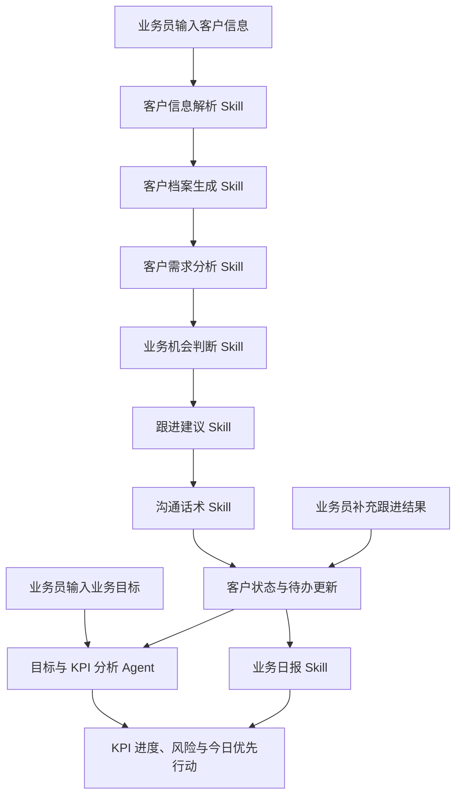

# 知客 ZhiKe AI：W3 目标驱动业务 Agent 设计

> 文档版本：W3 Agent Design v1.0（设计稿）  
> 适用赛段：S3 全球青年培育赛 · W3 半决赛  
> 参赛赛道：X创新赛道  
> 项目名称：知客 ZhiKe AI  
> 项目副标题：面向业务员的 AI 业务处理智能体

## 1. 文档目的

本文件定义知客 ZhiKe AI 在 W3 阶段的 Agent 形态、交互边界、Skills 调度方式、会话状态和评测口径。W3 的目标不是在 W2 网页 Demo 上叠加一个 KPI 看板，而是将已验证的客户处理 Skills 整合为可持续交互的业务 Agent。

知客 W3 Agent 面向单个业务员的日常工作：用户设定业务目标，输入客户线索或补充跟进结果；Agent 据此理解客户、判断商机、安排行动优先级，并根据目标进度与客户状态给出下一轮策略建议。

本文件是 W3 的设计与验收依据，不将尚未完成的开发内容表述为已实现能力。实际功能以可运行代码、Demo 和评测记录为准。

## 2. W3 产品定位与升级范围

### 2.1 W3 Agent 定位

> 知客 ZhiKe AI 是面向业务员的目标驱动型客户跟进与业务管理智能体。它将客户信息、业务目标和跟进反馈转化为可执行的客户行动、进度判断和风险提醒。

知客不是通用聊天机器人，也不是传统 CRM。它不以保存尽可能多的客户资料为目标，而是围绕“当前业务目标下，业务员下一步最值得做什么”组织客户理解、业务判断和行动生成。

### 2.2 W2 到 W3 的连续性

W2 已验证的核心客户处理链继续保留：

```text
客户信息输入
→ 客户信息解析
→ 客户档案生成
→ 客户需求分析
→ 业务机会判断
→ 跟进建议生成
→ 沟通话术生成
→ 业务日报生成
```

W3 在此基础上增加“目标—反馈—调整”的 Agent 回路：

```text
业务目标设定
→ 客户处理与行动生成
→ 跟进结果反馈
→ 客户状态更新
→ KPI 进度与风险分析
→ 下一轮行动优先级调整
```

### 2.3 W3 不包含的范围

W3 不以完整 CRM、企业级绩效考核或外部系统集成为交付目标。以下能力属于后续演进方向，而非 W3 已实现承诺：

- 微信自动读取或自动发送消息；
- 真实 CRM、日历、邮件或名片 OCR 接入；
- 企业级组织权限、薪酬计算或绩效管理；
- 跨企业的数据仓库和复杂 BI；
- 自动替代业务员发送话术、报价或做出最终业务决策。

## 3. Agent 用户价值

知客 W3 Agent 应同时解决两类问题：

1. **客户处理问题：** 面对一段零散沟通记录，业务员如何快速理解客户、判断机会并准备下一步沟通。
2. **业务推进问题：** 面对周目标或月目标，业务员如何判断自己是否落后、卡在哪个环节、今天应优先推进哪些客户。

因此，KPI 在知客中的角色是“行动型业务仪表盘”，而不是单纯的统计或考核工具。每一项进度差距都应尽量落到可执行的客户任务或资料准备动作上。

## 4. W3 Agent 总体工作流



该设计包含两条相互关联的链路：

- **客户处理链：** 将非结构化客户信息转化为结构化判断和可执行行动；
- **目标管理链：** 将业务目标、客户阶段、待办和反馈转化为进度分析、风险预警和行动优先级。

上层 Agent 负责根据当前交互意图选择和编排 Skills；每个 Skill 仍保持相对独立、可单独测试的输入输出边界。

## 5. Agent 输入契约

### 5.1 业务目标输入

W3 首先支持单个业务员的周目标或月目标。目标输入由用户明确提供，不由模型自行假设。

建议字段如下：

```json
{
  "period": "本周",
  "remaining_workdays": 4,
  "targets": {
    "new_qualified_customers": 10,
    "effective_communications": 8,
    "solution_meetings": 3,
    "priority_customers_to_advance": 3
  }
}
```

字段规则：

- 未填写的目标不参与完成度计算；
- 剩余工作日未填写时，不输出基于时间节奏的预警；
- 成交金额、成交率等无法从当前数据得到的指标，必须由用户输入或标记为未知；
- 目标值是用户目标，不等同于系统预测或承诺。

### 5.2 客户信息输入

沿用 W2 的自然语言输入方式，支持聊天摘要、电话纪要、会议记录和手动备注。用户无需预先整理为固定表格。

### 5.3 跟进反馈输入

跟进反馈是 W3 与 W2 的关键差异。业务员可以补充已发生的事实，例如：

```text
李总确认下周三线上沟通；
王经理要求补充数据安全说明；
陈老师暂未回复。
```

反馈输入必须描述已发生或用户确认的内容。若用户仅表达猜测，系统应将其标记为推断或待确认，而不是直接更新为客户事实。

### 5.4 时间与资源输入

可选输入包括剩余工作日、当日可投入时间和当前优先事项。W3 不做自动日历同步；时间信息由用户手动输入或使用演示预置值。

## 6. Agent 会话状态与记忆边界

W3 应在一次可演示会话内维护必要的业务状态，使 Agent 能够理解“上一轮处理了什么、这次反馈改变了什么”。

建议的会话状态包括：

```json
{
  "business_goal": {},
  "customers": [],
  "customer_stage_history": [],
  "follow_up_feedback": [],
  "tasks": [],
  "kpi_snapshot": {},
  "source_scope": "当前演示会话"
}
```

状态边界：

- 客户状态变更必须保留对应的输入依据或人工反馈依据；
- 每个待办需关联具体客户、产生原因、优先级和建议时点；
- W3 可采用演示用本地存储或会话内记忆实现连续交互；如未实现跨会话持久化，页面应清楚说明该边界；
- 真实长期客户记忆、团队共享和企业级权限不在本阶段作为既成能力宣传。

## 7. Skills 调度设计

### 7.1 现有客户处理 Skills

W3 复用并整合 W2 已定义的七个 Skills：

| 序号 | Skill | 在 W3 Agent 中的职责 |
|---|---|---|
| 1 | 客户信息解析 | 从输入和反馈中提取结构化事实、推断与未知项 |
| 2 | 客户档案生成 | 建立或更新统一客户视图 |
| 3 | 客户需求分析 | 区分显性需求、潜在痛点、阻碍和待确认问题 |
| 4 | 业务机会判断 | 审慎判断机会等级、信号和风险 |
| 5 | 跟进建议生成 | 把客户判断转化为行动、时点、目标和准备材料 |
| 6 | 沟通话术生成 | 按客户阶段和沟通目标生成可编辑参考话术 |
| 7 | 业务日报生成 | 汇总客户、待办、风险和下一步计划 |

### 7.2 新增：目标与 KPI 分析能力

W3 新增“目标与 KPI 分析”能力。该能力可以作为独立 `kpi_agent.py` 模块或 Agent 下的专用 Skill，但必须使用确定性计算处理数字，再由模型解释原因和生成行动建议。

输入：

- 用户定义的业务目标；
- 会话中的客户数量、客户阶段、机会等级和待办；
- 已确认的跟进反馈；
- 剩余工作日等时间信息。

输出：

- 目标完成情况；
- 过程指标统计；
- 当前瓶颈；
- 预警项；
- 今日优先行动；
- 数据范围与计算说明。

### 7.3 调度规则

1. 首次输入客户信息时，Agent 执行客户处理链，并写入客户状态与待办；
2. 用户输入跟进反馈时，Agent 优先执行状态更新、机会重评和待办调整；
3. 用户更新目标时，Agent 重新计算 KPI，并调整客户优先级；
4. 生成日报时，Agent 读取当前会话内有效客户和待办，不凭空添加集合外客户；
5. 后续 Skills 优先读取前序结构化字段、必要证据和状态摘要，不重复传递全部原始长文本。

## 8. KPI 计算与行动映射

### 8.1 指标层级

| 指标层 | 指标示例 | 作用 |
|---|---|---|
| 结果指标 | 成交客户数、完成方案沟通数 | 判断目标结果的差距 |
| 过程指标 | 新增有效客户、有效沟通、需求确认、重点跟进 | 定位业务推进的卡点 |
| 质量指标 | 待办完成率、客户信息完整度、重点客户响应及时性 | 防止只追数量而忽略业务质量 |

W3 优先使用可从用户输入、会话记录或演示数据中获得的过程指标。没有真实数据来源的成交金额、转化率等数据不得由模型编造。

### 8.2 计算原则

```text
完成度 = 已确认完成数量 / 用户设定目标数量
时间进度 = 已使用工作日 / 周期总工作日（仅在相关信息完整时计算）
进度差 = 完成度 - 时间进度
```

若目标、时间范围或完成事实缺失，Agent 应说明无法完成相应计算，而不是输出伪精确百分比。

### 8.3 行动映射原则

KPI 分析的合格输出不能停留在“进度落后”。每项预警应至少关联以下内容：

- 落后的指标；
- 可回溯的数据依据；
- 可能的业务瓶颈；
- 受影响的客户或待办；
- 建议的下一步行动。

示例：

> 有效沟通目标当前完成度低于时间节奏。当前中高机会客户中，李总尚未锁定沟通档期、王经理待补充数据安全材料。建议先完成这两项准备和邀约，避免继续分散投入到低信息完整度客户。

## 9. 输出契约

一次完整 W3 交互应至少形成以下四类对用户可见的结果：

| 输出模块 | 核心内容 | 数据性质 |
|---|---|---|
| 客户业务报告 | 客户档案、需求、商机、跟进建议、话术 | 事实、推断、未知必须可区分 |
| 客户状态更新 | 阶段变化、优先级、待办与风险变化 | 必须可回溯到客户输入或跟进反馈 |
| KPI 进度报告 | 目标、已完成、完成度、预警、数据范围 | 数字由规则计算，预测单独标注 |
| 今日优先行动 | 最多三至五项最重要的客户动作 | 必须包含对象、动作、时点和目标 |

建议使用统一结构化 Schema 管理输出，并在前端以易读卡片、清单和表格呈现，不直接暴露未格式化 JSON。

## 10. 事实边界与质量控制

知客 W3 Agent 必须延续 W2 的事实边界控制，同时增加对 KPI 数据来源的约束。

| 信息类别 | 定义 | 输出规则 |
|---|---|---|
| 事实 | 用户输入、客户原话或已确认跟进结果 | 可作为档案、状态和统计依据 |
| 计算结果 | 根据事实和明确公式得到的数值 | 标明计算范围与公式依据 |
| 推断 | 基于事实作出的业务判断 | 标明为推断，并提供验证方向 |
| 预测 | 基于当前节奏对未来的估算 | 标明为预测及其假设，不等同于承诺 |
| 未知 | 输入缺失或无法判断的信息 | 标注待确认，转化为后续问题或任务 |

其他约束：

- 不虚构预算、决策链、成交概率、客户数量或执行结果；
- 不把“客户感兴趣”直接写成“高意向”；
- 沟通话术不承诺未经验证的价格、效果或交付条件；
- 输出只作业务辅助，最终对外发送与业务决策由人工确认；
- KPI 不能直接用于自动奖惩或替代管理者绩效判断。

## 11. W3 Demo 交互脚本

W3 Demo 应展示 Agent 的连续性，而不是只展示一次性报告生成。建议演示路径如下：

1. 业务员设定周目标，例如“完成 8 次有效沟通、推进 3 个重点客户、完成 2 次方案沟通”；
2. 业务员输入一个新客户的沟通记录，Agent 生成客户处理报告和初始待办；
3. 业务员补充跟进反馈，例如“已确认线上会议”或“客户要求补充材料”；
4. Agent 更新客户阶段、机会判断和待办优先级；
5. Agent 汇总当前客户集合，计算 KPI 进度与风险；
6. Agent 输出今日优先行动和下一轮跟进建议。

Demo 中应明确显示数据范围：哪些为当前会话数据、哪些为 W2 遗留的演示 Mock 数据、哪些为用户手动填写的业务目标。

## 12. W3 评测口径

除沿用 W2 的信息提取、档案结构化、需求分析、机会判断、跟进建议、话术和日报评测外，W3 增加以下评测维度：

| 维度 | 评测问题 | 合格要求 |
|---|---|---|
| Agent 工作流完整性 | 是否能在一次交互中调度所需 Skills 并形成完整结果 | 输出链完整，字段可用，失败可定位 |
| 上下文连续性 | 反馈输入后是否正确更新客户状态 | 状态变化可回溯到反馈，不丢失原有关键事实 |
| KPI 计算准确性 | 数字是否由明确数据和规则计算 | 可复算，不虚构数据 |
| KPI 风险判断 | 是否识别进度差和业务瓶颈 | 预警有依据，不夸大结论 |
| 行动调整质量 | 是否将目标差距转化为具体动作 | 建议包含对象、动作、时点和目标 |
| 用户交互体验 | 是否可完成“目标—执行—反馈—调整”闭环 | 非技术业务员可理解和操作 |

基础自动化、页面测试与云端 MiniMax API 三案例验收的实际结果记录在 `docs/11_w3_test_evidence.md`。未完成的人工易用性走查仍明确保留为可选补充，不将目标值写成已达成结果。

## 13. W3 交付验收清单

- [x] Agent 可从网页入口运行；
- [x] 用户可以输入业务目标、客户信息和跟进反馈；
- [x] 原有客户处理 Skills 能被统一调度；
- [x] KPI 计算使用可追溯的会话内演示数据；
- [x] 系统能生成 KPI 风险与今日优先行动；
- [x] README 清楚说明 W3 已实现范围与未实现边界；
- [x] 提供可访问的 Demo 链接和清晰本地运行方式。
- [x] 三个内置案例完成云端 MiniMax API 模式复验并留存结果；
- [ ] 客户状态和待办的多轮更新行为完成独立人工验收；
- [ ] 补充未参与开发者的 3 分钟易用性测试记录。

## 14. 总结

知客 W3 Agent 的关键升级不是增加一组 KPI 数字，而是让业务目标、客户判断、行动执行和跟进反馈形成闭环。通过“结构化 Skills + 会话状态 + 确定性 KPI 计算 + 审慎业务建议”，知客将从 W2 的业务处理 Prototype 进化为可交付、可交互、可评测的目标驱动型业务 Agent。
