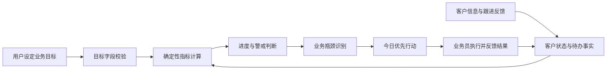

# 知客 ZhiKe AI：W3 业务目标与 KPI 框架

> 文档版本：W3 KPI Framework v1.0（设计稿）  
> 适用赛段：S3 全球青年培育赛 · W3 半决赛  
> 参赛赛道：X创新赛道  
> 项目名称：知客 ZhiKe AI  
> 关联文档：`docs/07_w3_agent_design.md`

## 1. 文档目的

本文件定义知客 ZhiKe AI 在 W3 阶段如何使用业务目标与 KPI，帮助业务员从“处理单个客户”升级为“围绕目标安排客户行动”。

知客中的 KPI 不用于自动绩效考核、薪资计算或替代管理者判断。它的作用是：基于用户明确设定的目标和可回溯的业务事实，识别业务推进中的差距与瓶颈，并生成下一步可执行的行动建议。

本文件定义的是 W3 设计和验收规则。具体实现应以可运行 Agent、前端交互和实际评测结果为准。

## 2. KPI 设计原则

### 2.1 目标驱动，而非报表堆叠

每个 KPI 必须回答至少一个业务问题：

- 当前目标完成到什么程度；
- 业务卡在哪个环节；
- 哪些客户或待办最影响目标；
- 今天应该优先做什么；
- 若不调整，可能出现什么风险。

如果一个指标不能帮助业务员做出行动选择，则不应成为 W3 的核心 KPI。

### 2.2 数据可追溯

KPI 数值只能来自以下来源：

1. 用户手动设定的业务目标；
2. 用户输入的客户信息和已确认跟进反馈；
3. 当前会话或明确范围内的客户状态、待办状态；
4. 通过公开公式从上述事实计算得出的结果；
5. 为 Demo 明确标注的演示数据。

模型不得自行补写成交金额、客户数量、转化率、会议次数或任务完成结果。

### 2.3 先过程，后结果

W3 优先采用业务员可以直接改变的过程指标，例如有效沟通、需求确认、方案沟通和重点客户推进。成交金额、长期转化率等结果指标可以保留接口，但只有在用户提供真实数据时才计算。

### 2.4 数字计算与语言解释分离

指标的数量、完成度和差距应由确定性规则计算；大模型负责解释可能原因、归纳风险和生成行动建议。这样可以避免模型在语言生成过程中随意编造精确数字。

### 2.5 预警优先于评分

W3 的 KPI 重点是发现风险并争取调整时间，而不是给业务员打一个绝对分数。系统可使用“正常 / 关注 / 预警”状态，不将指标直接映射为人员奖惩。

## 3. KPI 总体模型



该模型形成“目标—执行—反馈—调整”的循环。KPI 不独立于客户处理流程，而是读取客户阶段、机会等级、待办和反馈，并反向影响后续行动优先级。

## 4. W3 KPI 指标体系

### 4.1 结果指标

| 指标 | 定义 | W3 使用条件 | 主要用途 |
|---|---|---|---|
| 成交客户数 | 周期内被用户确认成交的客户数量 | 用户明确记录成交事实时 | 判断最终成交目标差距 |
| 方案沟通完成数 | 已完成方案介绍、演示或方案讨论的客户数量 | 用户输入或反馈确认完成时 | 判断中后段推进效果 |
| 重点客户推进数 | 周期内状态有实质前进的高/中高机会客户数量 | 必须有阶段变化或明确推进事实 | 判断重点资源投入是否有效 |

### 4.2 过程指标

| 指标 | 定义 | 计数条件 | 主要用途 |
|---|---|---|---|
| 新增有效客户数 | 本周期新增且具备至少一项明确需求或可跟进信息的客户 | 客户进入当前会话/数据范围且满足有效线索规则 | 判断线索开发进度 |
| 有效沟通数 | 产生新业务事实、需求确认、会议预约或资料请求的沟通 | 不能仅以“发送消息”计数 | 判断实际沟通推进 |
| 需求确认数 | 客户的核心需求、关注点或下一步信息获得明确确认 | 有用户反馈或可回溯证据 | 判断客户理解质量 |
| 方案沟通数 | 完成面向客户的方案、演示或解决方案讨论 | 需明确已完成，而非计划进行 | 判断方案阶段推进 |
| 高优先级待办完成数 | 高优先级客户的关键待办被确认完成 | 待办状态为完成并有依据 | 判断行动执行情况 |

### 4.3 质量指标

| 指标 | 定义 | 计算或判断方式 | 主要用途 |
|---|---|---|---|
| 待办完成率 | 已完成待办占到期或计划待办的比例 | 已完成数 / 有效待办数 | 发现执行拖延风险 |
| 客户信息完整度 | 关键档案字段已知或待确认标注的覆盖程度 | 已填写或明确标注字段 / 规定字段数 | 判断是否适合进入下一阶段 |
| 重点客户响应及时性 | 高优先级客户是否在建议时点内获得处理 | 对比建议时点与反馈记录 | 发现关键客户被遗忘风险 |

质量指标用于辅助解释过程问题，不能作为对个人能力的自动结论。

## 5. 目标输入与字段规则

### 5.1 W3 最小目标集

W3 建议优先支持以下四个目标字段：

```json
{
  "period": "本周",
  "remaining_workdays": 4,
  "new_qualified_customers_target": 10,
  "effective_communications_target": 8,
  "solution_meetings_target": 3,
  "priority_customers_to_advance_target": 3
}
```

### 5.2 目标字段校验

- 目标值应为非负整数；
- 未设置的目标字段不显示完成率，不参与总评；
- 目标为 0 时，显示“本周期未设此项目标”，不进行除法计算；
- `remaining_workdays` 仅用于节奏预警，不用于推断用户工作时长；
- 周目标和月目标不可混在同一个计算周期内；如用户修改周期，应生成新的 KPI 快照。

### 5.3 业务目标输入示例

```text
本周目标：
新增有效客户 10 个；
完成有效沟通 8 次；
完成方案沟通 3 次；
推进 3 个重点客户；
本周剩余 4 个工作日。
```

## 6. 指标计算规则

### 6.1 基础完成度

对于有目标值的指标：

```text
完成度 = 已确认完成数量 / 目标数量
```

展示时可保留百分比，但原始分子、分母和数据范围必须可查看。

示例：

```text
有效沟通：6 / 8，完成度 75%
```

### 6.2 待办完成率

```text
待办完成率 = 已完成有效待办数 / 有效待办总数
```

以下待办不应计入“已完成”：

- 仅由模型建议、但用户未确认执行的待办；
- 没有明确客户或对象的泛化建议；
- 已取消、重复或超出当前数据范围的待办。

### 6.3 时间节奏与进度差

仅在用户给出周期总工作日和剩余工作日，或明确给出时间进度时，系统才计算节奏差：

```text
时间进度 = 已使用工作日 / 周期总工作日
进度差 = 指标完成度 - 时间进度
```

若周期总工作日未知，系统只显示完成度，不输出“领先/落后时间进度”的判断。

### 6.4 预测边界

如果系统根据当前完成速度估算目标能否按期完成，必须同时显示：

- 这是预测而非事实；
- 使用的历史或当前节奏依据；
- 预测成立所需的假设；
- 数据不足时应显示“暂不预测”。

不允许把预测结果写成“必然完成”或“必然无法完成”。

## 7. 警戒线与风险规则

### 7.1 状态分级

| 状态 | 判断示例 | Agent 输出要求 |
|---|---|---|
| 正常 | 完成度不低于时间进度，或时间信息不足 | 展示进度与保持动作 |
| 关注 | 完成度略低于时间进度，或关键待办接近建议时点 | 提示具体客户/任务，建议补救动作 |
| 预警 | 关键目标明显落后，或高优先级客户存在延期/信息缺口 | 说明风险依据、受影响客户和优先行动 |
| 暂不判断 | 目标、时间或完成事实不足 | 明确缺什么信息，提出待确认问题 |

W3 的阈值应在代码中可配置，并在 Demo 中说明为演示规则，而不是通用于所有行业的固定标准。

### 7.2 典型预警条件

- 时间进度已明显超过某过程目标的完成度；
- 高优先级客户超过建议时点仍无有效跟进反馈；
- 多个重点客户同时缺少预算、决策链或需求确认信息；
- 大量待办未完成，且没有延期原因；
- 当前客户集合中中低优先级客户占用过多行动资源。

### 7.3 预警输出模板

```text
预警指标：有效沟通目标
事实依据：本周已确认完成 4 次，目标为 8 次；当前剩余 1 个工作日。
风险判断：若无新增有效沟通，本周目标可能无法完成（预测）。
优先动作：先联系李总确认会议档期，再向王经理发送数据安全说明；两项均可形成有效沟通或推进事实。
```

## 8. KPI 与客户优先级的联动

KPI 不应要求业务员盲目增加活动数量。Agent 应结合机会等级、客户阶段、信息完整度、待办时点和风险因素，生成优先级建议。

建议排序原则：

1. 已有明确下一步窗口、且与当前目标直接相关的客户优先；
2. 中高或高机会客户优先于低机会客户，但需同时考虑信息完整度和风险；
3. 能补齐关键未知项的行动优先于重复发送泛化资料；
4. 即将逾期的高优先级待办优先；
5. 若目标落后，不建议只增加低质量新增线索来“冲数量”。

示例：

```text
本周方案沟通目标落后时，优先推进已经明确需求、等待会议确认或资料补充的客户；
不应仅因为需要完成数量，就把预算、需求和决策角色均未知的客户直接判定为重点客户。
```

## 9. KPI 输出结构

建议 `kpi_agent.py` 返回统一结构，供 Streamlit 和日报模块共同渲染：

```json
{
  "period": "本周",
  "data_scope": "当前会话内的用户输入客户、跟进反馈与明确演示数据",
  "goal_progress": [
    {
      "metric": "effective_communications",
      "label": "有效沟通",
      "target": 8,
      "actual": 6,
      "completion_rate": 0.75,
      "status": "关注",
      "data_type": "calculated"
    }
  ],
  "bottlenecks": [],
  "warnings": [],
  "priority_actions": [],
  "unknowns": [],
  "calculation_notes": []
}
```

字段说明：

- `actual`：仅表示已确认发生或可回溯的数量；
- `completion_rate`：由规则计算；
- `status`：正常、关注、预警或暂不判断；
- `warnings`：必须包含事实依据与风险说明；
- `priority_actions`：必须指向具体客户或明确的开发动作；
- `unknowns`：说明当前无法计算或判断的原因。

## 10. 与业务日报的整合

W3 的业务日报应从 W2 的“跨客户待办与风险汇总”升级为“客户进展 + 目标进度 + 行动优先级”的复盘结果。

建议新增以下区块：

1. 本周期目标与当前完成度；
2. 重点客户推进情况；
3. KPI 关注项或预警项；
4. 影响目标的跨客户待办；
5. 今日优先行动；
6. 数据范围、计算说明和待确认信息。

W3 仍应明确区分：用户输入/反馈形成的事实、规则计算结果、Agent 的推断与预测。若仍使用 W2 Mock 客户用于演示，必须标明其仅为演示数据，不能与真实客户统计混淆。

## 11. W3 评测标准

| 评测项 | 测试方法 | 合格标准 |
|---|---|---|
| 目标字段校验 | 输入完整、缺失、0 值和异常目标 | 不发生错误计算；缺失项明确提示 |
| KPI 计算准确性 | 使用人工可复算的客户与任务集合 | 分子、分母、完成度一致 |
| 数据可追溯性 | 检查每项实际数量与来源记录 | 不出现无依据客户数或完成数 |
| 警戒判断合理性 | 构造正常、关注、预警和数据不足案例 | 状态与规则一致，理由清楚 |
| 行动映射可执行性 | 人工评审优先行动 | 至少包含对象、动作、时点和目标 |
| 事实边界控制 | 输入预算/决策链缺失的案例 | 不补写事实；推断和预测明确标注 |
| 交互可理解性 | 非技术用户按 Demo 操作 | 能理解目标、进度、风险和下一步 |

实际评测结果应在 W3 Agent 完成后，使用真实运行输出填写，不提前将目标表述为已达成成绩。

## 12. 实施与验收边界

W3 实现时应优先完成：

- 目标输入与字段校验；
- 客户/待办/反馈的会话内状态；
- 确定性 KPI 统计和完成度计算；
- 规则化的预警状态；
- 基于客户状态与 KPI 差距的行动建议；
- 与原有客户处理报告、日报的联合展示。

以下能力可在后续阶段扩展：

- 基于长期真实历史数据的个性化转化预测；
- 自动拉取 CRM、微信、日历或邮件记录；
- 团队级 KPI、人员绩效考核和企业权限；
- 行业专属目标模板和复杂漏斗建模。

## 13. 总结

知客 W3 的 KPI 框架以“数据可追溯、计算可复算、风险可解释、行动可执行”为原则。它不把 KPI 当作额外的报表模块，而是将目标差距转化为客户跟进优先级和下一步业务动作，使知客 Agent 能在客户处理之外，持续帮助业务员管理业务推进节奏。
